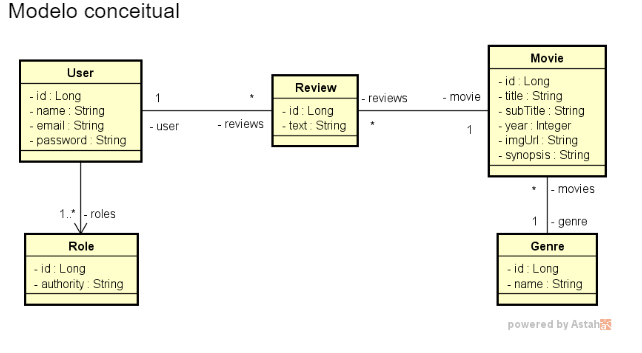

# Desafio Movieflix casos de uso

### Implemente as funcionalidades necessárias para que os testes do projeto abaixo passem.

<h1 align="left">
  
</h1>

### 🛠 Tecnologias

As seguintes ferramentas foram usadas na construção do projeto:

- [Java Spring Boot](https://spring.io/)
- [Java Spring Data](https://spring.io/projects/spring-data)
- [Java Spring Web](https://spring.io/projects/spring-ws)
- [Java Spring H2 Database](https://www.baeldung.com/spring-boot-h2-database)
- [Java Spring Validation](https://spring.io/guides/gs/validating-form-input)
- [Java Spring Security](https://spring.io/projects/spring-security)

### Casos de Uso

### - Listar Filmes
1. [OUT] O sistema apresenta uma listagem dos nomes de todos gêneros, bem como uma listagem paginada com título, subtítulo, ano e imagem dos filmes, ordenada alfabeticamente por título.
2. [IN] O usuário visitante ou membro seleciona, opcionalmente, um gênero.
3. [OUT] O sistema apresenta a listagem atualizada, restringindo somente ao gênero selecionado.

### - Visualizar detalhes do filme
1. [IN] O usuário visitante ou membro seleciona um filme
2. [OUT] O sistema informa título, subtítulo, ano, imagem e sinopse do filme, e também uma listagem dos textos das avaliações daquele filme juntamente com nome do usuário que fez cada avaliação.
3. [IN] O usuário membro informa, opcionalmente, um texto para avaliação do filme.
4. [OUT] O sistema apresenta os dados atualizados, já aparecendo também a avaliação feita pelo usuário.

Exceção 3.1 - Texto vazio
3.1.1. O sistema apresenta uma mensagem de que não é permitido texto vazio na avaliação

### Competências avaliadas:
- Desenvolvimento TDD de API Rest com Java e Spring Boot

- Realização de casos de uso

- Consultas a banco de dados relacional com Spring Data JPA

- Tratamento de erros com respostas HTTP customizadas

- Controle de acesso por perfil de usuário e rotas

